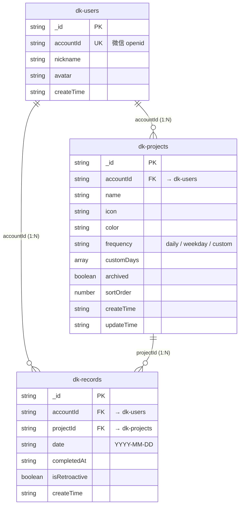

# TT Daka 数据库表设计

## 概览

使用阿里云 EMAS Serverless 数据库（MongoDB 协议），共 3 个集合（Collection）。所有集合通过 `accountId` 字段实现数据隔离，每个用户只能访问自己的数据。

```
dk-users       用户信息
dk-projects    打卡项目
dk-records     打卡记录
```

## 表结构

### dk-users（用户表）

| 字段 | 类型 | 必填 | 说明 |
|------|------|------|------|
| _id | string | 自动 | 文档 ID |
| accountId | string | 是 | 用户唯一标识（微信 openid） |
| nickname | string | 否 | 昵称 |
| avatar | string | 否 | 头像 URL |
| createTime | string | 是 | 注册时间 YYYY-MM-DD HH:mm:ss |

### dk-projects（打卡项目表）

| 字段 | 类型 | 必填 | 说明 |
|------|------|------|------|
| _id | string | 自动 | 文档 ID |
| accountId | string | 是 | 所属用户 |
| name | string | 是 | 项目名称，最长 20 字符 |
| icon | string | 是 | 图标名称，如 `ri-run-line` |
| color | string | 是 | 主题色，如 `#3B82F6` |
| frequency | string | 是 | 打卡频率：`daily` / `weekday` / `custom` |
| customDays | number[] | 否 | 自定义打卡日，0=周日 ~ 6=周六 |
| archived | boolean | 是 | 是否已归档 |
| sortOrder | number | 是 | 排序权重，值越小越靠前 |
| createTime | string | 是 | 创建时间 YYYY-MM-DD HH:mm:ss |
| updateTime | string | 是 | 更新时间 YYYY-MM-DD HH:mm:ss |

### dk-records（打卡记录表）

| 字段 | 类型 | 必填 | 说明 |
|------|------|------|------|
| _id | string | 自动 | 文档 ID |
| accountId | string | 是 | 所属用户 |
| projectId | string | 是 | 关联项目 _id |
| date | string | 是 | 打卡日期 YYYY-MM-DD |
| completedAt | string | 是 | 完成时间 YYYY-MM-DD HH:mm:ss |
| isRetroactive | boolean | 是 | 是否为补打卡 |
| createTime | string | 是 | 记录创建时间 YYYY-MM-DD HH:mm:ss |

## 表关系



- **dk-users → dk-projects**：一个用户拥有多个打卡项目（通过 `accountId` 关联）
- **dk-projects → dk-records**：一个项目拥有多条打卡记录（通过 `projectId` 关联）
- **dk-users → dk-records**：一个用户拥有多条打卡记录（通过 `accountId` 关联，用于跨项目查询）

## 查询索引建议

| 集合 | 索引字段 | 用途 |
|------|----------|------|
| dk-projects | `{ accountId: 1, archived: 1, sortOrder: 1 }` | 首页项目列表 |
| dk-records | `{ accountId: 1, date: 1, projectId: 1 }` | 今日打卡状态查询 |
| dk-records | `{ accountId: 1, projectId: 1, date: -1 }` | 项目详情页记录列表 |
| dk-records | `{ accountId: 1, date: 1 }` | 日历页按月查询 |

## 业务约束

- 同一用户 + 同一项目 + 同一日期，最多一条打卡记录（通过业务层校验）
- 补打卡仅允许最近 7 天内的日期
- 删除项目时级联删除该项目下所有打卡记录
- `accountId` 来源于微信 `uni.login` 返回的 code（H5 预览时使用 mock 值）
